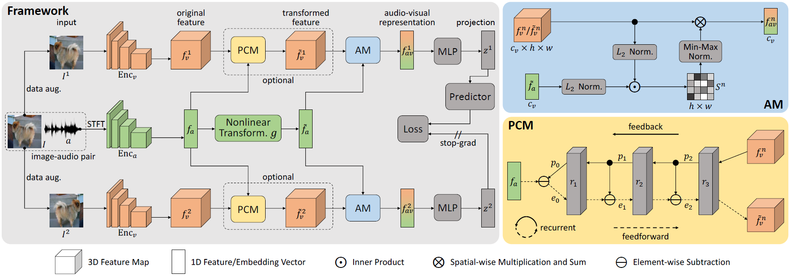

# Self-Supervised Predictive Learning (SSPL)
This repository hosts the PyTorch code for our self-supervised sound source localization method.


## Paper
Self-Supervised Predictive Learning: A Negative-Free Method for Sound Source Localization in Visual Scenes <br/>
[Zengjie Song](https://zjsong.github.io/)<sup>1</sup>, [Yuxi Wang]<sup>1,3</sup>, [Junsong Fan]<sup>1,2</sup>, 
[Tieniu Tan](http://cripac.ia.ac.cn/tnt/)<sup>1,2</sup>, [Zhaoxiang Zhang](https://zhaoxiangzhang.net/)<sup>1,2,3</sup> <br/>
<sup>1</sup>Center for Research on Intelligent Perception and Computing, NLPR, CASIA <br/>
<sup>2</sup>University of Chinese Academy of Sciences (UCAS) <br/>
<sup>3</sup>Centre for Artificial Intelligence and Robotics, HKISI_CAS <br/>
In Proc. IEEE Conf. Computer Vision and Pattern Recognition (CVPR), 2022 <br/>
[Paper] [arXiv] <br/>

> **Abstract:** *Sound source localization in visual scenes aims to localize objects emitting the sound in a given image. 
> Recent works showing impressive localization performance typically rely on the contrastive learning framework. 
> However, the random sampling of negatives, as commonly adopted in these methods, can result in misalignment between audio 
> and visual features and thus inducing ambiguity in localization. In this paper, instead of following previous literature, 
> we propose Self-Supervised Predictive Learning (SSPL), a negative-free method for sound localization via explicit positive mining. 
> Specifically, we first devise a three-stream network to elegantly associate sound source with two augmented views of 
> one corresponding video frame, leading to semantically coherent similarities between audio and visual features. 
> Second, we introduce a novel predictive coding module for audio-visual feature alignment. Such a module assists SSPL to 
> focus on target objects in a progressive manner and effectively lowers the positive-pair learning difficulty. 
> Experiments show surprising results that SSPL outperforms the state-of-the-art approach on two standard sound 
> localization benchmarks. In particular, SSPL achieves significant improvements of 8.6% cIoU and 3.4% AUC on SoundNet-Flickr 
> compared to the previous best.*




## Requirements
We have tested the code on the following environment:
* Python 3.8.6 | PyTorch 1.6.0 | torchvision 0.7.0 | CUDA 11.0 | Ubuntu 16.04.7


## Download & pre-process videos
We train models on respectively two video datasets: [SoundNet-Flickr](http://soundnet.csail.mit.edu/) and [VGG-Sound](https://www.robots.ox.ac.uk/~vgg/data/vggsound/), 
while testing on two corresponding benchmarks: [test set](https://github.com/ardasnck/learning_to_localize_sound_source) of SoundNet-Flickr 
and [test set](https://www.robots.ox.ac.uk/~vgg/research/lvs/) (i.e., VGG-Sound Source) of VGG-Sound. Videos are downloaded 
with [youtube-dl](https://github.com/ytdl-org/youtube-dl) if only the YouTube IDs are given. Please see main text (Sec. 4.2) 
for details of pre-processing video frame and audio signals. To improve data loading efficiency, we use [h5py](https://docs.h5py.org/en/stable/build.html) 
to respectively group frames, audios, and spectrograms, before training.

Take SoundNet-Flickr for example, the final data should be placed in the following structure:
```
Datasets
│
└───SoundNet_Flickr
│   │
|   └───10k_unlabeled
|   |   |   h5py_train_frames_10k.h5
|   |   |   h5py_train_audios_10k.h5
|   |   |   h5py_train_spects_10k.h5
|   |   |
|   └───144k_unlabeled
|   |   |   h5py_train_frames_144k_1.h5
|   |   |   ...
|   |   |   h5py_train_frames_144k_10.h5
|   |   |   h5py_train_audios_144k_1.h5
|   |   |   ...
|   |   |   h5py_train_audios_144k_10.h5
|   |   |   h5py_train_spects_144k_1.h5
|   |   |   ...
|   |   |   h5py_train_spects_144k_10.h5
|   |   |
|   └───5k_labeled
|   |   |
|   |   └───Annotations
|   |   |   |   10000130166.xml
|   |   |   |   ...
|   |   |   |   9992947874.xml
|   |   |   |
|   |   └───Data
|   |       |
|   |       └───audio
|   |       |   |   10000130166.wav
|   |       |   |   ...
|   |       |   |   9992947874.wav
|   |       |   |
|   |       └───frames
|   |           |   10000130166.jpg
|   |           |   ...
|   |           |   9992947874.jpg
|   |           |
|   └───flickr_test249_in5k.csv
|
└───VGG-Sound
    │
    └───10k_unlabeled
    |
    └───144k_unlabeled
    |
    └───5k_labeled
    |   |
    |   └───Annotations
    |   |   |   vggss_test_5158.json
    |   |   |
    |   └───Data
    |       |   h5py_test_frames.h5
    |       |   h5py_test_audios.h5
    |       |   h5py_test_spects.h5
    |       |
    └───vggss_test_4692.csv
```
**Note:**
* We provide ```flickr_test249_in5k.csv```, ```vggss_test_4692.csv```, and ```vggss_test_5158.json``` in ```metadata/```.
* Before training and testing, you should specify ```data_path = "path to Datasets"``` in ```arguments_train.py``` and ```arguments_test.py``` accordingly.


## Usage
### Training
We utilize [VGG16](https://arxiv.org/pdf/1409.1556.pdf%E3%80%82) and [VGGish](https://github.com/harritaylor/torchvggish) as backbones 
to extract visual and audio features, respectively. Before training, we need to place pre-trained VGGish weights, 
i.e., [vggish-10086976.pth](https://github.com/harritaylor/torchvggish/releases/download/v0.1/vggish-10086976.pth) and 
[vggish_pca_params-970ea276.pth](https://github.com/harritaylor/torchvggish/releases/download/v0.1/vggish_pca_params-970ea276.pth) 
in ```models/torchvggish/torchvggish/vggish_pretrained/```. To train SSPL on SoundNet-Flickr10k with default setting, just run:
```
python main.py
```
**Note:** We found that learning rates have vital influence on SSPL's performance. So we recommend to use the early stopping strategy 
to select hyperparameters and avoid overfitting.

### Test
After training, ```frame_best.pth```, ```sound_best.pth```, ```ssl_head_best.pth``` (and ```pcm_best.pth``` for SSPL (w/ PCM)) 
can be obtained, and we need to place them in ```models/pretrain/``` before testing. To test SSPL on SoundNet-Flickr 
with default setting, just run:
```
python test.py
```


## Citation
Please consider citing our paper in your publications if the project helps your research.
```
@inproceedings{song2022sspl,
  title={Self-Supervised Predictive Learning: A Negative-Free Method for Sound Source Localization in Visual Scenes},
  author={Song, Zengjie and Wang, Yuxi and Fan, Junsong and Tan, Tieniu and Zhang, Zhaoxiang},
  booktitle =  {Proc. IEEE Conf. Computer Vision and Pattern Recognition (CVPR)},
  year={2022}
}
```


## Acknowledgement
Our code is partially based on [Attention](https://github.com/ardasnck/learning_to_localize_sound_source), 
[HardWay](https://github.com/hche11/Localizing-Visual-Sounds-the-Hard-Way), and [SimSiam](https://github.com/PatrickHua/SimSiam). 
We thank the authors for sharing their code.